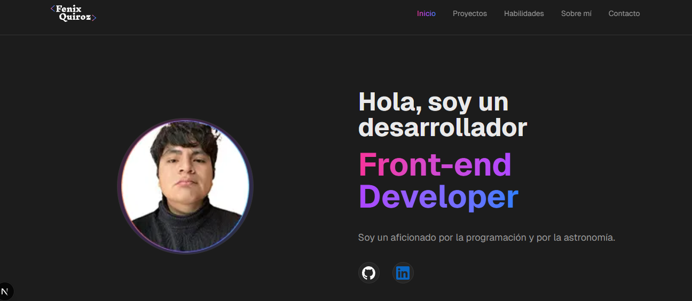

# Fenix Quiroz — Frontend Developer

Portfolio personal donde muestro mis proyectos, habilidades y mi camino en el desarrollo web.

- Link del proyecto: [PORTFOLIO](https://portfolio-one-henna-95.vercel.app/)

## 👋 Sobre mí

Soy un desarrollador frontend en formación, apasionado por la programación y la astronomía. 
Comencé a interesarme por el desarrollo web tras ver a mi hermano adentrarse en este mundo y conseguir trabajo como programador, lo que despertó mi curiosidad.

He aprendido de forma autodidacta, complementando con cursos en CoderHouse y un bootcamp en LemonCode, donde reforcé mis bases y mi forma de pensar como desarrollador. Actualmente estoy en búsqueda de mi primera oportunidad profesional.

## 🧠 Tecnologías

- HTML, CSS, JavaScript
- React, Next.js
- TypeScript
- Tailwind CSS
- Git & GitHub
- Figma

---

### 7️⃣ Contacto
MUY importante.

## 📬 Contacto

- Email: [fenixquiroz10@gmail.com](mailto:fenixquiroz10@gmail.com)
- GitHub: https://github.com/Fenix-Quiroz
- LinkedIn: https://www.linkedin.com/in/fenix-quiroz-b7b960240/
